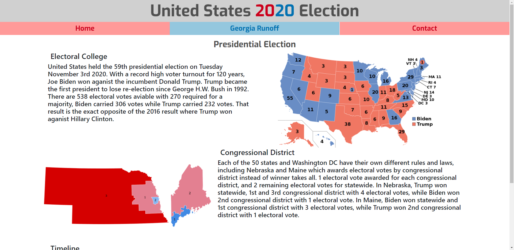
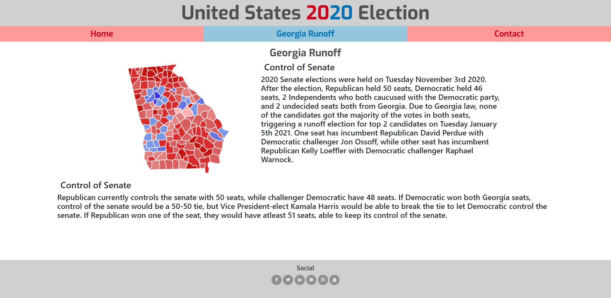
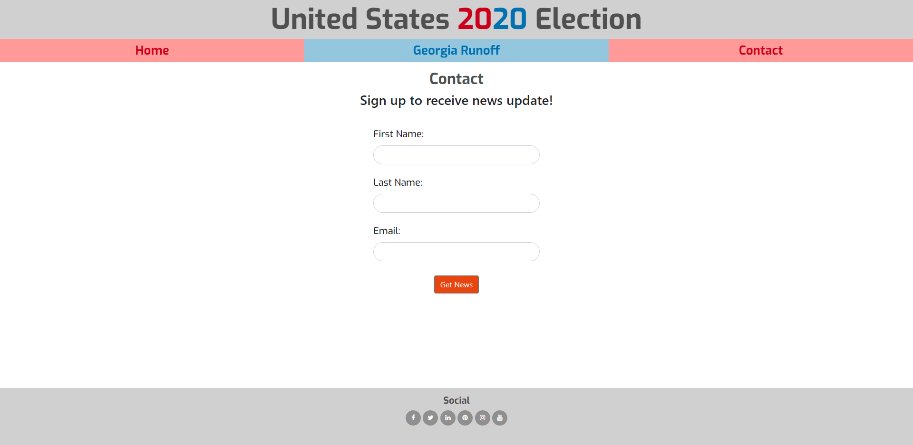
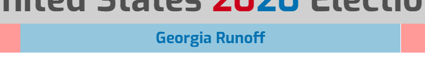
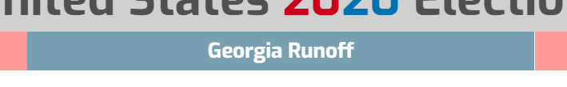

# Election2020

## About
I developed a [website](https://FortyTwoFortyTwo.github.io/Election2020/index.html) for Code Institute's User Centric Frontend Development Project. The website's goal is to explain the United States 2020 election.
There is also a section for the Georgia Senate Runoff and a contact page to sign up for a newsletter.
The website is designed to be simple and easy to use on any platform or scale. There is a tab menu to switch between pages.

## Index – Table of Contents
* [User Experience (UX)](#user-experience) 
* [Features](#features)
* [Designs](#designs)
* [Technologies Used](#technologies-used)
* [Testing](#testing)
* [Known Bugs](#known-bugs)
* [Deployment](#deployment)
* [Acknowledgements](#credit)

## User Experience
The landing page is about the US general presidental election 2020 with a map of all states, user nagivating using tabs to Georgia Runoff and Contacts page.
The tabs and footer animates when the user hovers over to show what they are going to click.
Contact has a simple form to fill it out.

#### Reasons a user may visit the website
* A user looking to read US general presidental election 2020.
* A user looking to read Georgia runoff and the balance of the Senate.
* A user signing for news update

#### Reasons for the website
* Explain the US general presidental election 2020.
* Explain why the Georgia Runoff is so important.
* Provide a way for new and existing clients to contact us.  

## Features

##### Navigation Bar
The Navigation Bar is at the top of the webpage. The nav links are highlighted when hovered over. The nav links direct the user to the correct page of the website.

##### Footer
The footer contains social links, highlighted when hovered over.

## Designs

Hovering the tabs highlights it.

## Technologies used
* HTML5
* CSS3
* [HTML Validator](https://validator.w3.org/) for validity of HTML
* [CSS Validator](https://jigsaw.w3.org/css-validator/) for validity of CSS
* [Bootstrap4](https://getbootstrap.com) for the grid layout, components and styling
* [Font Awesome](https://fontawesome.com/) for icons and logos.
* [Hover.css](https://ianlunn.github.io/Hover/) for animations on hovering buttons
* [Git](https://git-scm.com/) for version control.
* [GitHub](https://github.com/) for the repository to store the files.
* [GitHub Pages](https://pages.github.com/) to deploy the site.

## Testing
[HTML Validator](https://validator.w3.org/) and [CSS Validator](https://jigsaw.w3.org/css-validator/) were used to check if there any warnings or errors in HTML and CSS, which there is none.

#### Opening browser
Website can be opened by google chrone, microsoft edge and phones

#### Screen Size
Website is responsive when screen changes size to fit for any sizes

#### Buttons
Buttons that directs to home, georgia and home page all works

#### Form
Form page with inbox can be typed, but button to submit does not do anything.

## Known Bugs
in Footer, clicking "Get News" button shows "405 Not Allowed". This is becasue the newsletter is not setup as it not part of the project.

## Deployment

#### Adding and Committing files
To add files to the repository take the following steps

In the command line type -
        git add .  
        git commit -m "This is being committed"
        git push

To add all new files or modified file use " ."  - To add a single file use the pathway to the file eg .index.html  or assets/css/style.css
When committing make sure your comments are clear about what changes have been made. 
Pushing will send your work to the repository

#### Deployment 
The project was deployed with the following steps

* Logged into git hub
* Clicked the "Settings" button in the menu above the Repository.
* Scroll down the Settings page to the "GitHub Pages" Section.
* Under "Source", click the dropdown called "None" and then select "Master Branch".
* The page will automatically refresh, and a link displaced.  It may take some time for the link to show the website.
* If the page will not load go down to "template" under the "source" and select a template. 
* Scroll back down through the page to locate the now published site link in the "GitHub Pages" section.

#### Forking
By forking the GitHub Repository, you can make a copy of the original repository in your own GitHub account.  This means we can view or make changes without making the changes affecting the original.

* Log into GitHub and locate the GitHub Repository.
* At the top of the Repository there is a "Fork" button about the "Settings" button on the menu.
* You should now have a new copy of the original repository in your own GitHub account.

### Cloning
* Log into your GitHub then find the gitpod repository
* Under the repository name there is a button that says "Clone or download". Click on this button.
* If cloning with HTTPS "Clone with HTTPS", copy this link.
* Open Gitbash
* Change the current working directory to the location where you want the cloned directory to be.
* Type git clone, and then paste the URL you copied earlier.

        $ git clone https://github.com/YOUR-USERNAME/YOUR-REPOSITORY
        Press - Enter- Your local clone will be created.
        $ git clone https://github.com/YOUR-USERNAME/YOUR-REPOSITORY
                > Cloning into `CI-Clone`...
                > remote: Counting objects: 10, done.
                > remote: Compressing objects: 100% (8/8), done.
                > remove: Total 10 (delta 1), reused 10 (delta 1)
                > Unpacking objects: 100% (10/10), done.
[Click Here](https://docs.github.com/en/free-pro-team@latest/github/creating-cloning-and-archiving-repositories/cloning-a-repository) for more info on cloning. 

## Credit
* Brian Macharia - Mentor support, guidance, tips, and key things to look out for throughout the project. Helping me to check for errors and looking at my code.

All images is taken from wikipedia under public domain.